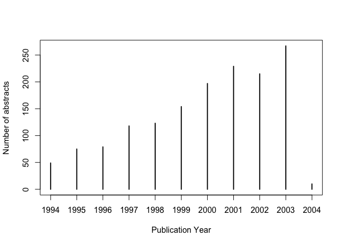
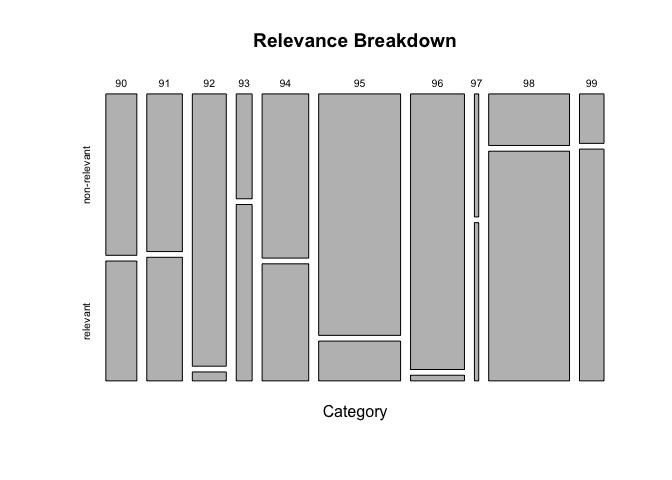

# TREC 2005 training abstracts
Santina Lin  
December 3, 2015  

```r
library(plyr) # mutate()
```

This markdown is for a quick inspection of the TREC2005 training dataset, using the metadata generated from `../parsing_code/parse_training_data.py`. 


```r
meta <- read.table("../info_data/metaData.txt", sep="\t", quote="")
```

# Quick inspection and restructuring 

```r
str(meta)
```

```
## 'data.frame':	1516 obs. of  6 variables:
##  $ V1: int  90 90 90 90 90 90 90 90 90 90 ...
##  $ V2: Factor w/ 3 levels "DR","NR","PR": 1 3 2 2 3 3 2 3 1 1 ...
##  $ V3: Factor w/ 1506 levels "[A case of multiple endocrine neoplasia type 2A (MEN2A) with a mutation in the RET gene]",..: 104 324 1265 290 868 270 995 1078 829 1312 ...
##  $ V4: int  15376909 15290769 15239941 15239939 15130795 15130793 15130791 15130790 14708120 14679077 ...
##  $ V5: Factor w/ 491 levels "Acta Biochim Pol",..: 236 264 97 97 45 45 45 45 83 34 ...
##  $ V6: int  2003 2003 2003 2003 2003 2003 2003 2003 2003 2003 ...
```
There are some columns that should be factors. Let's do some cleaning on this data frame.


```r
colnames(meta) <- c("category", "relevance", "title", "pmid", "journal", "pubYear")
meta$category <- as.factor(meta$category)
meta$pubYear <- as.factor(meta$pubYear)
str(meta)
```

```
## 'data.frame':	1516 obs. of  6 variables:
##  $ category : Factor w/ 10 levels "90","91","92",..: 1 1 1 1 1 1 1 1 1 1 ...
##  $ relevance: Factor w/ 3 levels "DR","NR","PR": 1 3 2 2 3 3 2 3 1 1 ...
##  $ title    : Factor w/ 1506 levels "[A case of multiple endocrine neoplasia type 2A (MEN2A) with a mutation in the RET gene]",..: 104 324 1265 290 868 270 995 1078 829 1312 ...
##  $ pmid     : int  15376909 15290769 15239941 15239939 15130795 15130793 15130791 15130790 14708120 14679077 ...
##  $ journal  : Factor w/ 491 levels "Acta Biochim Pol",..: 236 264 97 97 45 45 45 45 83 34 ...
##  $ pubYear  : Factor w/ 11 levels "1994","1995",..: 10 10 10 10 10 10 10 10 10 10 ...
```

Much better. We see that we have 1516 entries, but there are 1506 unique titles. That's weird. 
Perhaps there are repeated papers  

```r
title_occurrences <- table(meta$title)
(nrepeats <- length(subset(title_occurrences, title_occurrences>1)))
```

```
## [1] 10
```
So there are 10 papers that occur more than once, which help explain why there are less unique titles (or abstracts) than the total number of abstracst in this training dataset. 

See the distribution of publication years

```r
plot(table(meta$pubYear), xlab="Publication Year", ylab="Number of abstracts")
```

 

How many journals are there: 

```r
(njournals <- length(unique(meta$journal)))
```

```
## [1] 491
```

There are also 491 different journals. 

# Category breakdown 


```r
table(meta$category)
```

```
## 
##  90  91  92  93  94  95  96  97  98  99 
## 115 132 126  59 173 304 200  16 300  91
```

```r
table(meta$category, meta$relevance)
```

```
##     
##       DR  NR  PR
##   90  22  66  27
##   91  40  74  18
##   92   3 122   1
##   93  28  22   9
##   94  36 101  36
##   95  23 261  20
##   96   3 196   1
##   97   8   7   1
##   98 222  55  23
##   99  46  16  29
```

As we can see, some categories have much more abstracts than the others. Some categories have very few abstracts that are relevant relatively to the total number of abstracst in those categories.

In our evaluation of SVD, we group PR (probably relevant) and DR (definitely relevant) together. So let's combine those two together and see the break down between relevant and non-relevant. 


```r
# Function to map NR, PR, DR to another string  
isRelevant <- function(category){
  if(category == 'NR'){
    return('non-relevant');
  }
  return('relevant'); # if PR or DR 
}

# Use the function to add a column to our meta dataframe 
relevances <- unlist(llply(meta$relevance, isRelevant)) # it cannot be a list, needs to be an array of strings (character) 
meta <- mutate(meta, class = relevances)
meta$class <- as.factor(meta$class)

# See the breakdown of relevant and non-relevant abstracts in each category : 
plot(table(meta$category, meta$class), main="Relevance Breakdown", xlab="Category")
text(5,5)
```

 

The width of each bar represents the number of papers in that category. Some categories have much fewer relevant papers. So we might need to correct for that when evaluate our document clustering prediction. 

