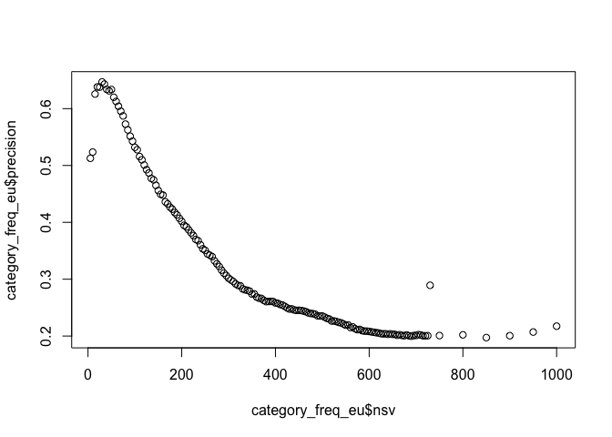
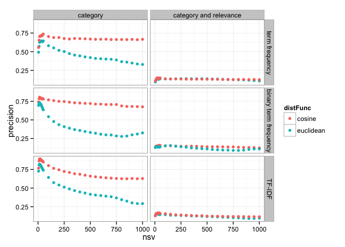

# Evaluation of SVD on TREC 2005
Santina Lin  
December 3, 2015  


```r
library(ggplot2)
library(plyr) # mutate(), mapvalues()
library(knitr) # kable()
```

# Aim 

Evaluate the precision of clustering results using three different matrices (term frequency, binary, TF-IDF) in combination with two different distance functions (cosine and Euclidean) 

Each abstract has 20 top closest abstracts. There are two ways to measuring precision, either how precise they are in retrieving papers in the same category (number of the same category out of 20), or retriving **relevant** papers in the same categorie. 

# Results - Abstracts only 
Easier just to do side by side comparison. 

First, load the two datasets (two different evaluation standards)

```r
category <- read.table("../closest_neighbors/abstract-only/evaluation_category.result")
colnames(category) <- c("matrixType", "distFunc", "filename", "nsv", "precision")
str(category)
```

```
## 'data.frame':	671 obs. of  5 variables:
##  $ matrixType: Factor w/ 3 levels "term_freq","term_freq_binary",..: 2 2 2 2 2 2 2 2 2 2 ...
##  $ distFunc  : Factor w/ 2 levels "cosine","euclidean": 2 2 2 2 2 2 2 2 2 2 ...
##  $ filename  : Factor w/ 310 levels "cosine_10.neighbors",..: 156 157 158 159 160 161 162 163 164 165 ...
##  $ nsv       : int  10 100 1000 105 110 115 120 125 130 135 ...
##  $ precision : num  0.734 0.391 0.315 0.371 0.356 ...
```

```r
relevance<- read.table("../closest_neighbors/abstract-only/evaluation_relevance.result")
colnames(relevance) <- c("matrixType", "distFunc", "filename", "nsv", "precision")
str(relevance)
```

```
## 'data.frame':	671 obs. of  5 variables:
##  $ matrixType: Factor w/ 3 levels "term_freq","term_freq_binary",..: 2 2 2 2 2 2 2 2 2 2 ...
##  $ distFunc  : Factor w/ 2 levels "cosine","euclidean": 2 2 2 2 2 2 2 2 2 2 ...
##  $ filename  : Factor w/ 310 levels "cosine_10.neighbors",..: 156 157 158 159 160 161 162 163 164 165 ...
##  $ nsv       : int  10 100 1000 105 110 115 120 125 130 135 ...
##  $ precision : num  0.131 0.146 0.171 0.147 0.146 ...
```

Then combine the two datasets 

```r
all <- rbind( 
  mutate(category, evaluation="category"), 
  mutate(relevance, evaluation="category and relevance")
  )
all$evaluation <- as.factor(all$evaluation)
all$matrixType <- mapvalues(all$matrixType, from = c("tf_idf", "term_freq", "term_freq_binary"), to = c("TF-IDF", "term frequency", "binary term frequency"))
str(all)
```

```
## 'data.frame':	1342 obs. of  6 variables:
##  $ matrixType: Factor w/ 3 levels "term frequency",..: 2 2 2 2 2 2 2 2 2 2 ...
##  $ distFunc  : Factor w/ 2 levels "cosine","euclidean": 2 2 2 2 2 2 2 2 2 2 ...
##  $ filename  : Factor w/ 310 levels "cosine_10.neighbors",..: 156 157 158 159 160 161 162 163 164 165 ...
##  $ nsv       : int  10 100 1000 105 110 115 120 125 130 135 ...
##  $ precision : num  0.734 0.391 0.315 0.371 0.356 ...
##  $ evaluation: Factor w/ 2 levels "category","category and relevance": 1 1 1 1 1 1 1 1 1 1 ...
```

Then we use ggplot and facet grid to generate one graph 

```r
ggplot(all, aes(x=nsv, y=precision, colour=distFunc)) + geom_point() + 
  facet_grid(matrixType ~ evaluation) + theme_bw()
```

 


```r
maxima <- aggregate(precision ~ evaluation + matrixType + distFunc, max, data=all)  # see maximum of all combinations 
maxima <- merge(maxima, all[, c("precision", "nsv")], by="precision") # bring in the number of nsv 
maxima <- arrange(maxima, evaluation, matrixType) # arrange the dataframe
kable(maxima, format="markdown") # Ensure Github can render the table
```


| precision|evaluation             |matrixType            |distFunc  | nsv|
|---------:|:----------------------|:---------------------|:---------|---:|
| 0.6470179|category               |term frequency        |euclidean |  30|
| 0.7000000|category               |term frequency        |cosine    |  50|
| 0.7418146|category               |binary term frequency |euclidean |  15|
| 0.7800980|category               |binary term frequency |cosine    |  15|
| 0.8535225|category               |TF-IDF                |euclidean |  15|
| 0.8979412|category               |TF-IDF                |cosine    |  20|
| 0.1334848|category and relevance |term frequency        |cosine    |  50|
| 0.1674107|category and relevance |term frequency        |euclidean | 730|
| 0.1398352|category and relevance |binary term frequency |cosine    |  35|
| 0.1782178|category and relevance |binary term frequency |euclidean | 850|
| 0.1565990|category and relevance |TF-IDF                |cosine    |  30|
| 0.1655702|category and relevance |TF-IDF                |euclidean | 200|

Including relevance judgement definitely drops the precision by a lot. We need to note that though, from [the look of our dataset](abstracts.md), there are many unrelevant papers compared to relevant papers in some categories. So that might have contributed to the much lower frequencies. Just by looking at categories, cosine distance function seems to do fairly well in predicting (with accuracy close to 80% in binary matrix) and as number of singular values increase, the precision doesn't drop as much, unlike using Euclidean distance. TF-IDF achieves the highest precision. 

The number of singular values needed to achieve higher precision when considering only category is surprisingly low. 


# Results - all text 
Same as before, except this time we are using not just abstract text, but also journal name and title of each abstrat. 

First, load the two datasets (two different evaluation standards)

```r
category <- read.table("../closest_neighbors/alltext/evaluation_category.result")
colnames(category) <- c("matrixType", "distFunc", "filename", "nsv", "precision")
relevance<- read.table("../closest_neighbors/alltext/evaluation_relevance.result")
colnames(relevance) <- c("matrixType", "distFunc", "filename", "nsv", "precision")
```

Then combine the two datasets 

```r
all <- rbind( 
  mutate(category, evaluation="category"), 
  mutate(relevance, evaluation="category and relevance")
  )
all$evaluation <- as.factor(all$evaluation)
all$matrixType <- mapvalues(all$matrixType, from = c("tf_idf", "term_freq", "term_freq_binary"), to = c("TF-IDF", "term frequency", "binary term frequency"))
```

Then we use ggplot and facet grid to generate one graph 

```r
ggplot(all, aes(x=nsv, y=precision, colour=distFunc)) + geom_point() + 
  facet_grid(matrixType ~ evaluation) + theme_bw()
```

 


```r
maxima <- aggregate(precision ~ evaluation + matrixType + distFunc, max, data=all)  # see maximum of all combinations 
maxima <- merge(maxima, all[, c("precision", "nsv")], by="precision") # bring in the number of nsv 
maxima <- arrange(maxima, evaluation, matrixType) # arrange the dataframe
kable(maxima, format="markdown") # Ensure Github can render the table
```


| precision|evaluation             |matrixType            |distFunc  | nsv|
|---------:|:----------------------|:---------------------|:---------|---:|
| 0.6443792|category               |term frequency        |euclidean |  30|
| 0.7365658|category               |term frequency        |cosine    |  50|
| 0.7308848|category               |binary term frequency |euclidean |  15|
| 0.8051845|category               |binary term frequency |cosine    |  15|
| 0.8211093|category               |TF-IDF                |euclidean |  15|
| 0.8911713|category               |TF-IDF                |cosine    |  15|
| 0.1391667|category and relevance |term frequency        |euclidean |  25|
| 0.1500000|category and relevance |term frequency        |cosine    |  25|
| 0.1560453|category and relevance |binary term frequency |euclidean | 150|
| 0.1587617|category and relevance |binary term frequency |cosine    |  40|
| 0.1586957|category and relevance |TF-IDF                |euclidean |  20|
| 0.1662791|category and relevance |TF-IDF                |cosine    |  40|


We can see that including title and journal names doesn't make a big difference. However, at least for Euclidean distance, it's obvious that precision doesn't dive down as much as number of singular values increases. So it's safer to use title + journal name + abstract instead of just using abstracts to find similar papers. 

# A separate inspection 

Using `../parsing_code/sparsity.py`, I found that out of the ~1 milion words in the word list (1062805 words), there are 4422 unique words from the list that occur in the abstracts. The most occurred word, which occured 1015 in total, is **gene**. 

# Further inspection (the potential TODOs)

There are other things that could be done to further analyze the result:

- Break down and inspect the precision measurement by categories -  There are some categories with very few relevant papers, so that could have dragged down the result
-  ~~Include titles of the abstracts in the text abstraction step - Title text is important too!~~ 
-  Try work "knock-out", either knocking down a word in an abstract of interest, or all the occurrences of the word in all the abstracts. 
- Bench mark using random selection : random select 20 papers for each paper to see how that precision compare to our algorithm.
