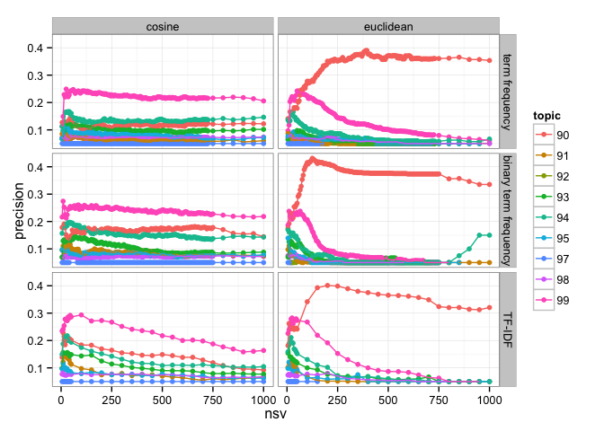
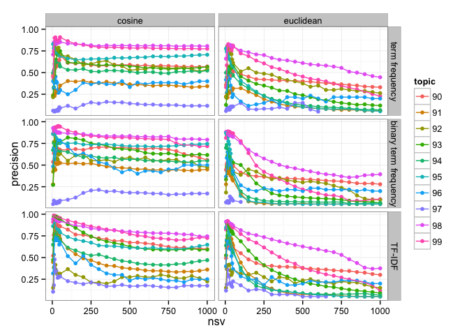
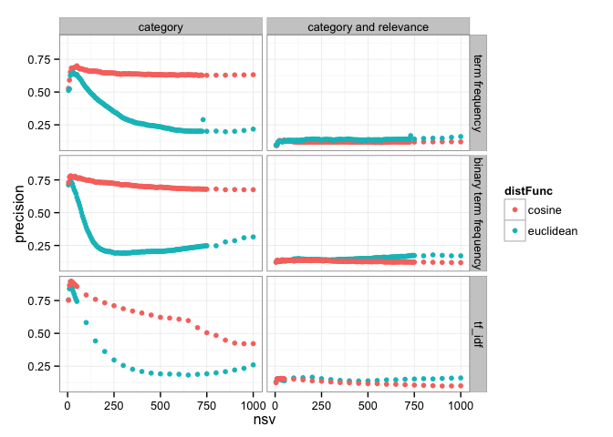

# Evaluation of SVD on TREC 2005
Santina Lin  
December 3, 2015  


```r
library(ggplot2)
library(plyr) # mutate(), mapvalues()
library(knitr) # kable()
```

# Aim 

Evaluate the precision of clustering results using two different matrix (term frequency and binary) in combination with two different distance functions (cosine and Euclidean) 

There are two ways to measuring precision, either how precise they are in retrieving papers in the same category, or retriving **relevant** papers in the same categorie. 

# Consider only category 

```r
category <- read.table("../closest_neighbors/evaluation_category.result")
colnames(category) <- c("matrixType", "distFunc", "filename", "nsv", "precision")
str(category)
```

```
## 'data.frame':	671 obs. of  5 variables:
##  $ matrixType: Factor w/ 3 levels "term_freq","term_freq_binary",..: 2 2 2 2 2 2 2 2 2 2 ...
##  $ distFunc  : Factor w/ 2 levels "cosine","euclidean": 2 2 2 2 2 2 2 2 2 2 ...
##  $ filename  : Factor w/ 310 levels "cosine_10.neighbors",..: 156 157 158 159 160 161 162 163 164 165 ...
##  $ nsv       : int  10 100 1000 105 110 115 120 125 130 135 ...
##  $ precision : num  0.734 0.391 0.315 0.371 0.356 ...
```

## Term Frequcy Matrix 

```r
category_freq <- category[category$matrixType == "term_freq",]
str(category_freq)
```

```
## 'data.frame':	303 obs. of  5 variables:
##  $ matrixType: Factor w/ 3 levels "term_freq","term_freq_binary",..: 1 1 1 1 1 1 1 1 1 1 ...
##  $ distFunc  : Factor w/ 2 levels "cosine","euclidean": 1 1 1 1 1 1 1 1 1 1 ...
##  $ filename  : Factor w/ 310 levels "cosine_10.neighbors",..: 1 2 3 4 5 6 7 8 9 10 ...
##  $ nsv       : int  10 100 1000 105 110 115 120 125 130 135 ...
##  $ precision : num  0.591 0.667 0.632 0.665 0.663 ...
```

### Euclidean 

```r
category_freq_eu <- category_freq[category_freq$distFunc=="euclidean", ]
plot(category_freq_eu$nsv, category_freq_eu$precision)
```

 

### Cosine 

```r
category_freq_co <- category_freq[category_freq$distFunc=="cosine", ]
plot(category_freq_co$nsv, category_freq_co$precision)
```

 

## Binary Matrix 

```r
category_bi <- category[category$matrixType == "term_freq_binary",]
str(category_bi)
```

```
## 'data.frame':	310 obs. of  5 variables:
##  $ matrixType: Factor w/ 3 levels "term_freq","term_freq_binary",..: 2 2 2 2 2 2 2 2 2 2 ...
##  $ distFunc  : Factor w/ 2 levels "cosine","euclidean": 2 2 2 2 2 2 2 2 2 2 ...
##  $ filename  : Factor w/ 310 levels "cosine_10.neighbors",..: 156 157 158 159 160 161 162 163 164 165 ...
##  $ nsv       : int  10 100 1000 105 110 115 120 125 130 135 ...
##  $ precision : num  0.734 0.391 0.315 0.371 0.356 ...
```

### Euclidean 

```r
category_bi_eu <- category_bi[category_bi$distFunc=="euclidean", ]
plot(category_bi_eu$nsv, category_bi_eu$precision)
```

 

### Cosine 

```r
category_bi_co <- category_bi[category_bi$distFunc=="cosine", ]
plot(category_bi_co$nsv, category_bi_co$precision)
```

 


# Consider relevance and category 

```r
relevance<- read.table("../closest_neighbors/evaluation_relevance.result")
colnames(relevance) <- c("matrixType", "distFunc", "filename", "nsv", "precision")
str(relevance)
```

```
## 'data.frame':	671 obs. of  5 variables:
##  $ matrixType: Factor w/ 3 levels "term_freq","term_freq_binary",..: 2 2 2 2 2 2 2 2 2 2 ...
##  $ distFunc  : Factor w/ 2 levels "cosine","euclidean": 2 2 2 2 2 2 2 2 2 2 ...
##  $ filename  : Factor w/ 310 levels "cosine_10.neighbors",..: 156 157 158 159 160 161 162 163 164 165 ...
##  $ nsv       : int  10 100 1000 105 110 115 120 125 130 135 ...
##  $ precision : num  0.131 0.146 0.171 0.147 0.146 ...
```

## Term Frequcy Matrix 

```r
relevance_freq <- relevance[relevance$matrixType == "term_freq",]
str(relevance_freq)
```

```
## 'data.frame':	303 obs. of  5 variables:
##  $ matrixType: Factor w/ 3 levels "term_freq","term_freq_binary",..: 1 1 1 1 1 1 1 1 1 1 ...
##  $ distFunc  : Factor w/ 2 levels "cosine","euclidean": 1 1 1 1 1 1 1 1 1 1 ...
##  $ filename  : Factor w/ 310 levels "cosine_10.neighbors",..: 1 2 3 4 5 6 7 8 9 10 ...
##  $ nsv       : int  10 100 1000 105 110 115 120 125 130 135 ...
##  $ precision : num  0.0925 0.1202 0.12 0.1211 0.121 ...
```

### Euclidean 

```r
relevance_freq_eu <- relevance_freq[relevance_freq$distFunc=="euclidean", ]
plot(relevance_freq_eu$nsv, relevance_freq_eu$precision)
```

 

### Cosine 

```r
relevance_freq_co <- relevance_freq[relevance_freq$distFunc=="cosine", ]
plot(relevance_freq_co$nsv, relevance_freq_co$precision)
```

 

## Binary Matrix 

```r
relevance_bi <- relevance[relevance$matrixType == "term_freq_binary",]
str(relevance_bi)
```

```
## 'data.frame':	310 obs. of  5 variables:
##  $ matrixType: Factor w/ 3 levels "term_freq","term_freq_binary",..: 2 2 2 2 2 2 2 2 2 2 ...
##  $ distFunc  : Factor w/ 2 levels "cosine","euclidean": 2 2 2 2 2 2 2 2 2 2 ...
##  $ filename  : Factor w/ 310 levels "cosine_10.neighbors",..: 156 157 158 159 160 161 162 163 164 165 ...
##  $ nsv       : int  10 100 1000 105 110 115 120 125 130 135 ...
##  $ precision : num  0.131 0.146 0.171 0.147 0.146 ...
```

### Euclidean 

```r
relevance_bi_eu <- relevance_bi[relevance_bi$distFunc=="euclidean", ]
plot(relevance_bi_eu$nsv, relevance_bi_eu$precision)
```

 

### Cosine 

```r
relevance_bi_co <- relevance_bi[relevance_bi$distFunc=="cosine", ]
plot(relevance_bi_co$nsv, relevance_bi_co$precision)
```

 

# Summary
Easier just to do side by side comparison. 

First, let's combine the two datasets 

```r
all <- rbind( 
  mutate(category, evaluation="category"), 
  mutate(relevance, evaluation="category and relevance")
  )
all$evaluation <- as.factor(all$evaluation)
all$matrixType <- mapvalues(all$matrixType, from = c("term_freq", "term_freq_binary"), to = c("term frequency", "binary term frequency"))
str(all)
```

```
## 'data.frame':	1342 obs. of  6 variables:
##  $ matrixType: Factor w/ 3 levels "term frequency",..: 2 2 2 2 2 2 2 2 2 2 ...
##  $ distFunc  : Factor w/ 2 levels "cosine","euclidean": 2 2 2 2 2 2 2 2 2 2 ...
##  $ filename  : Factor w/ 310 levels "cosine_10.neighbors",..: 156 157 158 159 160 161 162 163 164 165 ...
##  $ nsv       : int  10 100 1000 105 110 115 120 125 130 135 ...
##  $ precision : num  0.734 0.391 0.315 0.371 0.356 ...
##  $ evaluation: Factor w/ 2 levels "category","category and relevance": 1 1 1 1 1 1 1 1 1 1 ...
```

Then we use ggplot and facet grid to generate one graph 

```r
ggplot(all, aes(x=nsv, y=precision, colour=distFunc)) + geom_point() + 
  facet_grid(matrixType ~ evaluation) + theme_bw()
```

 


```r
maxima <- aggregate(precision ~ evaluation + matrixType + distFunc, max, data=all)  # see maximum of all combinations 
maxima <- merge(maxima, all[, c("precision", "nsv")], by="precision") # bring in the number of nsv 
maxima <- arrange(maxima, evaluation, matrixType) # arrange the dataframe
kable(maxima, format="markdown") # Ensure Github can render the table
```


| precision|evaluation             |matrixType            |distFunc  | nsv|
|---------:|:----------------------|:---------------------|:---------|---:|
| 0.6470179|category               |term frequency        |euclidean |  30|
| 0.7000000|category               |term frequency        |cosine    |  50|
| 0.7418146|category               |binary term frequency |euclidean |  15|
| 0.7800980|category               |binary term frequency |cosine    |  15|
| 0.8535225|category               |tf_idf                |euclidean |  15|
| 0.8979412|category               |tf_idf                |cosine    |  20|
| 0.1334848|category and relevance |term frequency        |cosine    |  50|
| 0.1674107|category and relevance |term frequency        |euclidean | 730|
| 0.1398352|category and relevance |binary term frequency |cosine    |  35|
| 0.1782178|category and relevance |binary term frequency |euclidean | 850|
| 0.1565990|category and relevance |tf_idf                |cosine    |  30|
| 0.1655702|category and relevance |tf_idf                |euclidean | 200|

Including relevance judgement definitely drops the precision by a lot. We need to note that though, from [the look of our dataset](abstracts.md), there are many unrelevant papers compared to relevant papers in some categories. So that might have contributed to the much lower frequencies. Just by looking at categories, cosine distance function seems to do fairly well in predicting (with accuracy close to 80% in binary matrix) and as number of singular values increase, the precision doesn't drop as much, unlike using Euclidean distance.

The number of singular values needed to achieve higher accuracy in each case is surprisingly low. 


# A separate inspection 

Using `../parsing_code/sparsity.py`, I found that out of the ~1 milion words in the word list (1062805 words), there are 4422 unique words from the list that occur in the abstracts. The most occurred word, which occured 1015 in total, is **gene**. 

